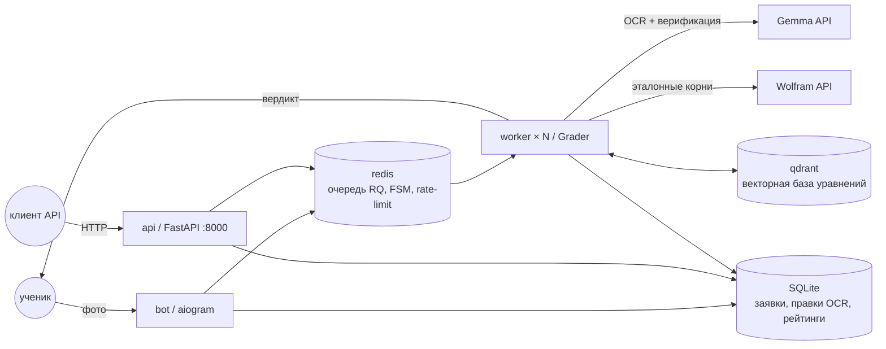
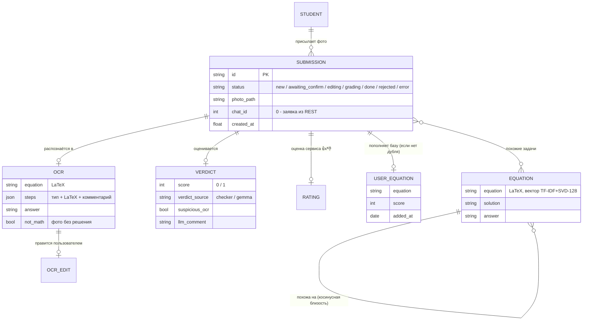

# Проверка задания №13 ЕГЭ по фото

## О проекте

Сервис автоматически проверяет рукописные решения задания №13 ЕГЭ по
профильной математике: ученик присылает фото решения — система распознаёт
его, формально проверяет выкладки и выставляет балл за пункт а) с объяснением.
Предназначен ученикам для самопроверки при подготовке и репетиторам для
быстрой проверки работ. В отличие от «обёртки над LLM», балл в большинстве
случаев выставляет формальный чекер (sympy + Wolfram), поэтому система
не завышает оценки: precision класса «верно» = 1.0. Бонус: к каждому
решению подбираются похожие задачи из векторной базы для тренировки.

## Демо

**Telegram-бот: [@test_ai_check_bot](https://t.me/test_ai_check_bot)** —
пришлите фото рукописного решения уравнения (можно альбомом, если решение
на нескольких страницах).

REST-вариант: Swagger UI на http://localhost:8000/docs после запуска.

<!-- TODO: GIF прохождения полного цикла (фото → OCR → правка → вердикт) -->

## Архитектура



Поток обработки: фото (альбом склеивается вертикально) → OCR (фото без
решения отсеиваются: правило not_math в промпте + проверка структуры) →
распознанный LaTeX рендерится картинкой → пользователь подтверждает или
правит построчно → формальный чекер; если чекер уверен в «1» — балл без
LLM, иначе LLM-верификация с отчётом чекера → вердикт + оценка 👍/👎 +
похожие задачи. Правки пользователя сохраняются (`ocr_original` vs `ocr`)
— готовая разметка ошибок распознавания; подтверждённые уравнения копятся
в коллекции `user_equations` с дедупликацией по нормализованному виду.

### Компоненты

| Путь | Роль |
|---|---|
| `core/grader.py` | точка входа ядра: OCR → чекер → LLM-верификация |
| `core/checker_v2.py` | формальный чекер: sympy + Wolfram, восстановление условия |
| `core/pipeline.py` | OCR (дословная транскрипция) + FORMAL VERIFICATION (Gemma) |
| `core/normalize.py`, `core/verdict.py` | нормализация LaTeX, извлечение балла из ответа LLM |
| `core/search_equations.py` | поиск похожих задач (Qdrant, косинусная близость) |
| `core/user_equations.py` | накопление присланных уравнений с дедупликацией |
| `core/build_equation_index.py` | сборка векторной базы из `data/*.jsonl` |
| `bot/` | Telegram-бот: хендлеры, FSM правок OCR, рендер LaTeX→PNG, SQLite |
| `worker/` | RQ-воркер: задачи recognize / grade / similar, доставка в чат |
| `api/` | REST (FastAPI): POST/GET/PATCH заявок, Swagger на /docs |
| `tests/` | pytest критических частей (42 теста) |
| `models/` | логрег типа уравнения + векторизатор запросов |
| `data/` | исходник векторной базы (jsonl, ~470 уравнений с решениями) |

### Доменная модель



Ключевое решение модели: у заявки хранятся **оба** состояния распознавания —
исходное (`ocr_original`) и исправленное пользователем (`ocr`). Их расхождение —
готовая разметка ошибок OCR для дообучения. Статусная машина заявки полностью
проживается и из Telegram, и через REST — ядро не знает о канале.

## Быстрый старт

```bash
git clone <repo> && cd bot_project
cp .env.example .env                 # вписать BOT_TOKEN и GOOGLE_API_KEY
docker compose up -d --build
docker compose run --rm worker python -m core.build_equation_index   # 1 раз: векторная база
```

Готово: бот отвечает в Telegram, REST — на http://localhost:8000/docs.

## Docker

`docker compose up -d --build` поднимает пять сервисов:

| Сервис | Что делает |
|---|---|
| `bot` | Telegram-бот (aiogram, long polling) |
| `worker` | Grader: OCR → чекер → LLM; масштабируется |
| `api` | REST (FastAPI), порт 8000 |
| `redis` | очередь RQ + состояния диалогов + rate-limit |
| `qdrant` | векторная база, дашборд http://localhost:6333/dashboard |

Фото и SQLite — в `./storage/` (общий volume). Логи: `docker compose logs -f worker`.

Масштабирование воркеров:

```bash
docker compose up -d --scale worker=3
```

Воркеры делят одну очередь RQ (каждая задача достаётся ровно одному),
а лимит внешнего API держит общий счётчик в Redis (`bot/ratelimit.py`):
слот берётся перед каждым обращением к модели, при исчерпании минутного
окна воркер ждёт следующего.

## Переменные окружения

Шаблон — [.env.example](.env.example):

| Переменная |  Описание |
|---|---|
| `BOT_TOKEN` |  токен Telegram-бота — получить у [@BotFather](https://t.me/BotFather) |
| `GOOGLE_API_KEY` |  ключ Google AI Studio — OCR и верификация решений (Gemma) |
| `WOLFRAM_API_KEY` | AppID Wolfram\|Alpha: эталонные корни для смешанных уравнений |
| `GEMINI_RPM` |  общий лимит запросов к модели в минуту на все воркеры |

## Метрики

Валидация (на этих данных настраивались промпты и чекер):

| Сет | N | Accuracy | F1 (верные) | Weighted-F1 |
|---|---|---|---|---|
| Валидационная часть (после выверки) | 200 | 1.000 | 1.000 | 1.000 |

Отложенные данные (система их не видела):

| Сет | N | Accuracy | F1 (верные) | Weighted-F1 |
|---|---|---|---|---|
| Отложенные: чистые сканы | 67 | 0.955 | 0.975 | 0.960 |
| Отложенные: полные бланки ЕГЭ | 166 | 0.970 | 0.985 | 0.985 |
| Синтетика (решения с ошибками) | 46 | 1.000 | — | — |
| **Все данные суммарно** | **479** | **0.983** | **0.990** | **0.984** |

Ключевые свойства системы: не выставляет незаслуженных баллов, не пропускает
ошибок, ~60% решений оценивает мгновенно и бесплатно формальным чекером.
Известное ограничение — строгость к опискам ученика в условии и к ошибкам
распознавания мелких символов; закрывается подтверждением распознанного
текста пользователем в боте.

## REST API

Тот же конвейер, что у бота (общая очередь и БД), Swagger: http://localhost:8000/docs

```bash
curl -X POST localhost:8000/submissions -F "photo=@solution.jpg"   # → {"id": ...}
curl localhost:8000/submissions/<id>                # polling: статус/OCR/вердикт
curl -X PATCH localhost:8000/submissions/<id>/ocr \
     -H 'Content-Type: application/json' -d '{"equation": "..."}'  # правка OCR
curl -X POST localhost:8000/submissions/<id>/confirm               # запустить оценку
curl -X POST localhost:8000/submissions/<id>/rating \
     -H 'Content-Type: application/json' -d '{"rating": 1}'        # 👍/👎
```

## Ядро (Grader)

```python
from core.grader import Grader
grader = Grader()                          # ключи из окружения

ocr = grader.recognize('photo.jpg')        # показать пользователю, дать исправить
result = grader.grade('photo.jpg', ocr)    # {'score': 0|1, 'verdict_source', ...}
similar = grader.similar_tasks(ocr['equation'], top_k=3)
```

`result['suspicious_ocr'] == True` — сигнал переспросить пользователя:
показать распознанный текст и дать исправить ошибки сканирования перед оценкой.

Проверка одного фото из консоли: `python -m core.grader photo.jpg`
(запускать из корня проекта — пути к моделям и базе относительные).

## Тесты

```bash
docker compose run --rm worker pytest tests/   # в контейнере (или локально: pytest tests/)
```

42 теста: починка JSON от OCR, парсер правок, рендер LaTeX, валидация
не-математики, БД, дедупликация базы уравнений, rate-limiter, REST API.
