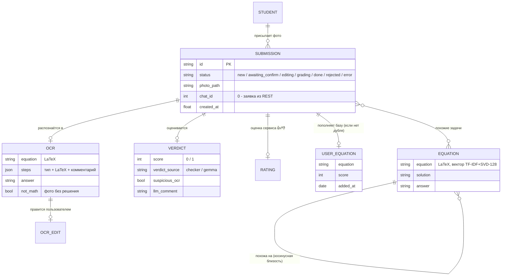

# Telegram-бот проверки задания №13 ЕГЭ

Оценка фото рукописного решения (0/1 за пункт а) + поиск похожих задач с решениями.

## Запуск (docker compose)

```bash
cp .env.example .env   # вписать BOT_TOKEN и GOOGLE_API_KEY
docker compose up -d --build
docker compose run --rm worker python migrate_qdrant.py  # 1 раз: перенести готовую базу в qdrant
```

Если локальной `qdrant_db/` нет (свежий клон) — собрать базу сразу в сервис:
`docker compose run --rm worker python build_equation_index.py`.

Сервисы: `bot` (aiogram, long polling), `worker` (Grader: OCR → чекер → LLM),
`api` (REST, порт 8000), `redis` (очередь RQ + FSM + rate-limit),
`qdrant` (векторная база, дашборд http://localhost:6333/dashboard).
Фото и SQLite — в `./storage/` (общий volume). Логи: `docker compose logs -f worker`.

### Масштабирование воркеров

```bash
docker compose up -d --scale worker=3
```

Воркеры делят одну очередь RQ (каждая задача достаётся ровно одному),
а лимит внешнего API (15 rpm Gemini, настраивается `GEMINI_RPM`) держит
общий счётчик в Redis — `bot/ratelimit.py`: слот берётся перед каждым
обращением к модели, при исчерпании окна воркер ждёт следующей минуты.

## Доменная модель



Ключевое решение модели: у заявки хранятся **оба** состояния распознавания —
исходное (`ocr_original`) и исправленное пользователем (`ocr`). Их расхождение —
готовая разметка ошибок OCR для дообучения. Статусная машина заявки полностью
проживается и из Telegram, и через REST — ядро не знает о канале.

Поток: фото (альбом склеивается вертикально) → OCR (фото без решения
уравнения отсеиваются: правило not_math в промпте + проверка структуры) →
рендер распознанного LaTeX картинкой → пользователь подтверждает или правит
построчно («3: …», «У: …», «О: …») → оценка → вердикт + оценка 👍/👎 +
похожие задачи. Правки пользователя сохраняются в SQLite (`ocr_original`
vs `ocr`) — бесплатная разметка мисридов OCR; подтверждённые уравнения
копятся в коллекции `user_equations` (дедуп по нормализованному виду).

## REST API

Тот же конвейер, что у бота (общая очередь и БД), Swagger: http://localhost:8000/docs

```bash
curl -X POST localhost:8000/submissions -F "photo=@solution.jpg"   # → {"id": ...}
curl localhost:8000/submissions/<id>                # polling: статус/OCR/вердикт
curl -X PATCH localhost:8000/submissions/<id>/ocr \
     -H 'Content-Type: application/json' -d '{"equation": "..."}'  # правка OCR
curl -X POST localhost:8000/submissions/<id>/confirm               # запустить оценку
curl -X POST localhost:8000/submissions/<id>/rating \
     -H 'Content-Type: application/json' -d '{"rating": 1}'        # 👍/👎
```

## Тесты

```bash
pytest tests/                                # локально
docker compose run --rm worker pytest tests/ # в контейнере
```

## Ядро (Grader)

## Точка входа

`grade_solution.py` → класс `Grader`:

```python
from grade_solution import Grader
grader = Grader()                          # ключи из окружения

ocr = grader.recognize('photo.jpg')        # показать пользователю, дать исправить
result = grader.grade('photo.jpg', ocr)    # {'score': 0|1, 'verdict_source', ...}
similar = grader.similar_tasks(ocr['equation'], top_k=3)
```

`result['suspicious_ocr'] == True` — сигнал переспросить пользователя
(условие противоречит шагам / уравнение не решается): показать распознанный
текст и дать исправить ошибки сканирования перед оценкой.

## Файлы

| Файл | Роль |
|---|---|
| `grade_solution.py` | API для бота (Grader) |
| `checker_v2.py` | формальный чекер: sympy + Wolfram, восстановление условия |
| `pipeline.py` | OCR (дословная транскрипция) + FORMAL VERIFICATION (Gemma) |
| `evaluate.py`, `evaluate_sympy.py` | извлечение балла, нормализация LaTeX |
| `search_equations.py` | поиск похожих задач (Qdrant, косинусная близость) |
| `build_equation_index.py` | пересборка векторной базы из data/*.jsonl |
| `models/` | логрег типа уравнения + векторизатор запросов |
| `qdrant_db/` | готовая база ~470 уравнений с решениями (embedded) |
| `data/` | исходник базы (jsonl) |

## Запуск

```bash
pip install -r requirements.txt
cp .env.example .env   # вписать ключи
python grade_solution.py photo.jpg
```

Работать из корня папки (пути к моделям/базе относительные).
В docker compose: ключи через env, qdrant можно вынести в отдельный
сервис `qdrant/qdrant` (тогда в search_equations заменить
`QdrantClient(path=...)` на `QdrantClient(url='http://qdrant:6333')`).

Ограничение API Gemini: 15 запросов/мин — в коде уже есть ретраи и паузы.

## Метрики

| Выборка | Accuracy | Weighted-F1 | F1 кл.1 | Precision кл.1 | Recall кл.0 |
|---|---|---|---|---|---|
| Golden set (200, выверенная разметка) | 1.000 | 1.000 | 1.000 | 1.000 | 1.000 |
| Honest holdout (67, система их не видела) | 0.955 | 0.960 | 0.975 | 1.000 | 1.000 |

Методика: golden set — 200 фото с выверенной вручную разметкой, на нём
настраивались промпты и чекер; honest holdout — 67 нетронутых решений
(62 верных + 5 ошибочных), к которым система не адаптировалась.

Precision кл.1 = 1.0 — балл не завышается: все промахи консервативные
(ложный ноль из-за нечитаемого почерка), лечатся подтверждением OCR
пользователем. ~60% решений оцениваются формальным чекером без LLM.
