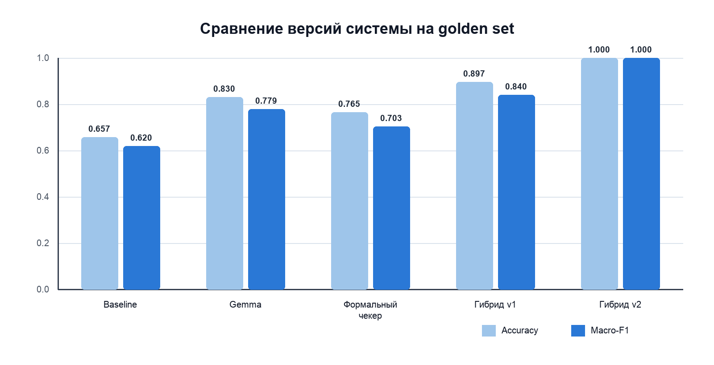
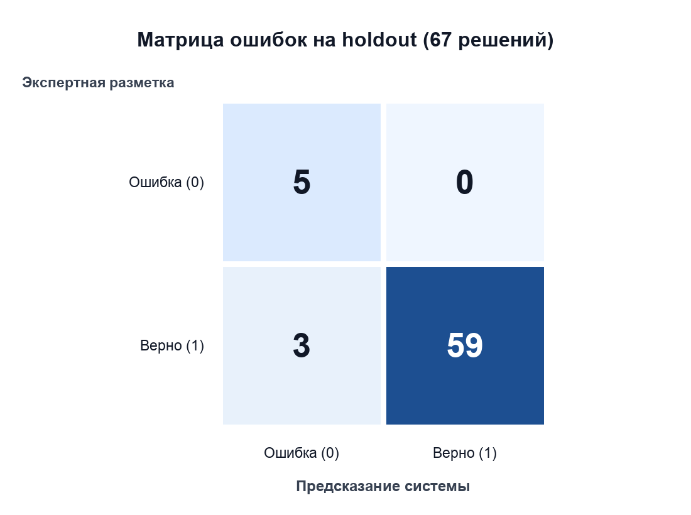

# Интеллектуальная система автоматической проверки развернутых решений задач ЕГЭ по профильной математике

## Актуальность проекта

Качественная обратная связь по развернутым математическим решениям является важной частью подготовки к экзаменам, однако ее предоставление требует значительных временных затрат со стороны преподавателя. В отличие от заданий с кратким ответом, такие работы нельзя надежно проверить простым сопоставлением с эталоном: необходимо распознать рукописный текст, восстановить логику рассуждений, проверить математические преобразования и определить, соответствует ли решение критериям оценивания.

Эта проблема особенно заметна при подготовке к заданиям второй части ЕГЭ по профильной математике. Ученик нуждается не только в итоговом балле, но и в быстрой, понятной обратной связи, которая позволяет определить место ошибки и скорректировать способ решения. При этом у преподавателя значительная часть времени уходит на повторяющиеся операции: чтение рукописи, проверку преобразований и подбор дополнительных заданий на выявленную тему.

Идея проекта возникла из моего восьмилетнего опыта преподавания математики и работы с учениками из разных стран. Практическое понимание процесса подготовки к ЕГЭ позволило сформулировать задачу не как создание отдельной модели, а как разработку целостного образовательного сервиса. Его назначение — автоматически обрабатывать фотографию решения, проверять его математическую корректность, предоставлять ученику обратную связь и предлагать похожие задания для дальнейшей практики.

## Цель и задачи

Цель проекта — разработать надежную интеллектуальную систему для автоматической проверки развернутых решений задач ЕГЭ по профильной математике. На текущем этапе система работает с заданием № 13, посвященным решению уравнений, и оценивает пункт «а» по бинарной шкале 0/1.

Для достижения цели решаются следующие задачи:

1. распознавание рукописного математического решения по фотографии и преобразование записи в структурированный формат LaTeX;
2. предоставление пользователю возможности проверить и исправить результат распознавания до выставления оценки;
3. формальная проверка уравнения, промежуточных преобразований и ответа с использованием символьных вычислений;
4. применение большой языковой модели в случаях, которые невозможно надежно обработать формальными правилами;
5. формирование понятного результата проверки с указанием итогового балла;
6. поиск похожих задач с решениями для продолжения подготовки;
7. накопление исправлений пользователей и обратной связи для последующего улучшения системы.

## Архитектура и принцип работы

Пользователь взаимодействует с системой через Telegram-бота: отправляет одну фотографию или альбом изображений с рукописным решением. Несколько фотографий автоматически объединяются в единое изображение. Далее OCR-модель выполняет дословное распознавание условия, последовательности шагов и ответа. Полученные математические выражения сохраняются в формате LaTeX.

Одной из ключевых особенностей проекта является обязательное подтверждение распознавания пользователем. Перед проверкой система визуализирует полученный LaTeX и предлагает подтвердить либо построчно исправить текст. Такой подход снижает влияние ошибок OCR на итоговый балл: система не должна считать математической ошибкой неверно распознанный символ или элемент рукописи. В базе данных сохраняются как исходная версия OCR, так и исправленная пользователем. Расхождения между ними образуют данные о реальных ошибках распознавания, которые в дальнейшем могут использоваться для анализа качества и дообучения моделей.

После подтверждения решение передается в модуль проверки. В основе проекта лежит гибридный подход, объединяющий детерминированные методы и генеративные модели. Формальный модуль восстанавливает математическое условие, нормализует выражения и проверяет их с помощью SymPy; для смешанных уравнений дополнительно используется Wolfram Alpha. Тип уравнения определяет логистическая регрессия, обученная на синтетическом наборе примерно из 20 тыс. уравнений. На 197 размеченных примерах golden set классификатор правильно определил тип во всех случаях (accuracy 1,000: 171 обычное и 26 смешанных уравнений). Если задача допускает однозначную алгоритмическую проверку, итоговый результат формируется без обращения к языковой модели. На независимой выборке таким способом были обработаны 40 из 67 решений, или 60%.

Если формальный модуль не может уверенно вынести вердикт, подключается LLM-компонент, анализирующий структуру решения и соответствие промежуточных шагов исходному условию. Таким образом, языковая модель не выступает единственным источником решения, а дополняет формальные методы в неоднозначных случаях. Это позволяет уменьшить риск галлюцинаций и сделать проверку более интерпретируемой. Дополнительные проверки выявляют противоречия между условием, ходом решения и ответом; при подозрении на ошибку распознавания система предлагает пользователю еще раз проверить полученный текст.

После оценивания пользователь получает балл и может отметить результат как корректный или некорректный. Затем сервис выполняет поиск похожих уравнений в векторной базе данных. Для представления математических выражений используются текстовая нормализация, TF-IDF-признаки и снижение размерности; поиск ближайших примеров осуществляется в Qdrant по косинусной близости. В базе находится около 470 уникальных уравнений с решениями, ответами и указанием категории. Качество поиска на эталонных списках задач-аналогов составило Recall@5 = 0,93. Подтвержденные пользовательские уравнения также могут добавляться в отдельную коллекцию с предварительным устранением дубликатов.

Система реализована как набор связанных сервисов. Telegram-бот отвечает за пользовательский сценарий, REST API предоставляет доступ к тому же конвейеру из внешних приложений, а фоновые воркеры выполняют ресурсоемкие операции распознавания и проверки. Очередь задач и общее ограничение запросов к внешним моделям реализованы с помощью Redis. Данные о заявках и пользовательских исправлениях сохраняются в SQLite, а векторный поиск выполняется в Qdrant. Сервисы контейнеризированы с использованием Docker Compose; количество воркеров может увеличиваться в зависимости от нагрузки. Общая логика проверки отделена от канала взаимодействия, поэтому один и тот же процесс доступен как через Telegram, так и через REST API.

## Текущие результаты и ограничения

На данный момент разработан работающий прототип, охватывающий полный пользовательский путь: от загрузки фотографии до получения оценки и подборки похожих задач. Развитие алгоритма проверялось на golden set из 200 фотографий рукописных решений: 165 решений в первоначальной разметке были верными, 35 содержали ошибку. Сравнение последовательных версий показало следующие результаты:

| Система | Покрытие | Accuracy | F1 верных решений | F1 ошибочных решений | Macro-F1 |
|---|---:|---:|---:|---:|---:|
| Формальный baseline | 35/200 | 0,657 | 0,739 | 0,500 | 0,620 |
| Gemma без формального отчета | 188/200 | 0,830 | 0,885 | 0,673 | 0,779 |
| Финальный формальный чекер | 149/200 | 0,765 | 0,839 | 0,568 | 0,703 |
| Гибрид v1: чекер + Gemma | 194/200 | 0,897 | 0,935 | 0,744 | 0,840 |
| Гибрид v2: Gemma с отчетом чекера | 200/200 | 1,000 | 1,000 | 1,000 | 1,000 |

*Рисунок 1. Accuracy и Macro-F1 последовательных версий системы на golden set. Результат гибрида v2 получен после настройки и ручной выверки этой выборки.*

Первая версия формального чекера выносила уверенный вердикт только по 17,5% решений. После добавления разбора замен переменных, составных шагов, расширенного LaTeX-парсера и маршрутизации в Wolfram покрытие увеличилось до 74,5%. Самостоятельная LLM-проверка обеспечила большее покрытие, но хуже справлялась со случаями, где требовалось точно вычислить и сопоставить серии корней. Гибрид v1 объединил сильные стороны двух подходов и повысил accuracy до 0,897, одновременно сократив число обращений к LLM на 48%.

В гибриде v2 языковая модель получает не только фотографию, но и формальный отчет: эталонные корни, результат сравнения ответа и построчную разметку преобразований. Дополнительно были введены правила обнаружения посторонних корней, дословной OCR-транскрипции и восстановления вероятно искаженного условия. После ручной выверки разметки итоговый golden set включал 166 верных и 34 ошибочных решения. На нем гибрид v2 получил полное покрытие 200/200, accuracy 1,000 и weighted F1 1,000. Поскольку эта выборка использовалась при разработке и настройке системы, данный результат характеризует качество реализации на выверенных сценариях, но не является независимой оценкой обобщающей способности.

Для независимой проверки использовался holdout из 67 ранее не использованных решений: 62 верных и 5 ошибочных. Полный конвейер OCR → формальный чекер → Gemma с отчетом запускался без ручной коррекции данных.

| Метрика на holdout | Значение |
|---|---:|
| Покрытие | 67/67 |
| Accuracy | 0,955 |
| Weighted-F1 | 0,960 |
| F1 верных решений | 0,975 |
| F1 ошибочных решений | 0,769 |
| Precision верных решений | 1,000 |
| Recall ошибочных решений | 1,000 |
| Проверено без LLM | 40/67 (60%) |

*Рисунок 2. Матрица ошибок гибрида v2 на независимой выборке: правильно распознаны 5 ошибочных и 59 верных решений; три верных решения получили консервативный ложный ноль.*

Система обнаружила все 5 решений с реальными ошибками и ни разу не выставила незаслуженную единицу. Три ошибочных вердикта были ложными нулями, поэтому поведение системы на holdout можно считать консервативным: она скорее направляет спорное решение на дополнительную проверку, чем завышает балл. Причинами оставшихся ошибок стали неточно переписанное условие и ошибки OCR при чтении мелких символов, в частности цифр, знака минуса и периода серии корней.

Полученные результаты подтверждают перспективность выбранной архитектуры, однако не означают, что задача полностью решена. Текущая выборка ограничена по объему и относится только к одному типу экзаменационного задания. Качество системы по-прежнему зависит от разборчивости почерка, качества фотографии и полноты записанного решения. Кроме того, для перехода от прототипа к образовательному продукту необходимы более масштабное тестирование, расширение набора заданий, систематическая оценка качества объяснений, мониторинг работы моделей и защита пользовательских данных.

## Развитие проекта в рамках магистратуры

Проект планируется развивать в рамках обучения в AI Talent Hub и использовать как основу выпускной квалификационной работы. Главная задача следующего этапа — перейти от работающего прототипа к надежному образовательному сервису, пригодному для регулярного использования реальными учениками.

Первое направление развития связано с компьютерным зрением и распознаванием рукописной математики. Планируется расширить набор размеченных данных, провести систематическое сравнение OCR-моделей и использовать накопленные пользовательские исправления для анализа типичных ошибок. Второе направление — совершенствование гибридной проверки: расширение формального модуля, исследование способов оркестрации специализированных компонентов и разработка критериев, по которым система выбирает между символьной проверкой и LLM-анализом. Третье направление включает эксплуатацию LLM-систем: мониторинг качества, управление версиями моделей и промптов, оценку устойчивости, оптимизацию стоимости и времени ответа.

В дальнейшем система должна поддерживать другие задания второй части ЕГЭ, анализировать не только итоговую правильность, но и отдельные этапы рассуждения, а также формировать персональные рекомендации для ученика. Поиск похожих задач может быть преобразован в адаптивный механизм, который учитывает тип допущенной ошибки и историю работы пользователя. Отдельным исследовательским вопросом является создание агентной архитектуры, в которой распознавание, формальная проверка, анализ критериев и формирование объяснения выполняются специализированными компонентами с контролируемым обменом результатами.

Выбор AI Talent Hub связан с практико-ориентированным форматом программы и возможностью развивать собственный AI-проект при поддержке специалистов. Дисциплины по компьютерному зрению, разработке AI-агентов, проектированию и эксплуатации LLM-систем непосредственно соответствуют техническим задачам проекта. Работа в Лаборатории прикладных агентов могла бы дать необходимую исследовательскую среду, наставничество и доступ к вычислительным ресурсам для проверки гипотез и подготовки выпускной работы или научной публикации.

Итоговой целью является создание интеллектуального помощника по профильной математике, который не заменяет преподавателя, а берет на себя часть рутинной проверки и обеспечивает ученику быструю первичную обратную связь. Сочетание преподавательского опыта, собственной аудитории и компетенций, полученных в магистратуре, позволит проверить систему в реальных образовательных сценариях и последовательно развивать ее как доступный и практически значимый AI-сервис.
